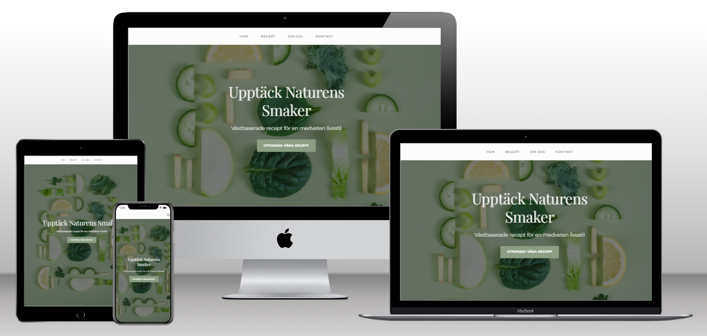

# Vegan Kök - Recept för Alla!

## Overview

This project is the **first of four Milestone Projects** for the **Full Stack Developer** course at The Code Institute. 
Vegan Kök is a responsive website dedicated to sharing delicious and easy vegan recipes. My mission is to inspire and simplify plant-based cooking for everyone. The site is built using **custom HTML5, CSS3, and minimal JavaScript**, ensuring an accessible, lightweight, and responsive experience across all devices.

Here is a quick preview of how the site looks on various screen sizes:

https://carlssonanton87.github.io/milestone-project-1/

## Table of Contents
- [User Experience (UX)](#user-experience-ux)
  - [Project Goals](#project-goals)
  - [User Stories](#user-stories)
  - [UX Design Rationale](#ux-design-rationale)
- [Design](#design)
  - [Wireframes](#wireframes)
  - [Color Palette & Typography](#color-palette--typography)
  - [Imagery](#imagery)
- [Features](#features)
  - [Existing Features](#existing-features)
  - [Future Features](#future-features)
- [Technologies Used](#technologies-used)
- [Testing](#testing)
- [Deployment](#deployment)
- [How to View Locally](#how-to-view-locally)
- [Credits](#credits)

---

## User Experience (UX)

### Project Goals

#### User Goals
- Discover a variety of easy and delicious vegan recipes.
- Learn the basics of plant-based cooking.
- Access quick, budget-friendly meal ideas.

#### Site Owner Goals
- Promote vegan cooking and healthy eating.
- Provide comprehensive and inspiring recipe resources.
- Build a community of plant-based cooking enthusiasts.

### User Stories
1. **New Vegan:** As a new vegan, I want simple, step-by-step recipes.  
2. **Busy Professional:** As a busy professional, I want quick meal ideas.  
3. **Budget-Conscious Cook:** As a budget-conscious cook, I want affordable ingredients.  
4. **Curious Food Lover:** As a curious food lover, I want to explore and learn more about vegan cooking.

### UX Design Rationale
My design decisions are rooted in a user-centric approach:

- **User-Focused Layout:**  
  A clean, intuitive structure ensures users quickly locate recipes and understand navigation without distraction.

- **Wireframe-Informed Structure:**  
  Early wireframes guided the placement of essential elements like the header, hero section, content areas, and footer for a smooth user journey across devices.

- **Accessibility & Readability:**  
  Clear typography, sufficient color contrast, and logical content structure enhance accessibility (including ARIA attributes and descriptive alt text).

- **Iterative Design Process:**  
  I continuously refined the layout based on user feedback and testing to improve the user experience.

---

## Design

### Wireframes
I began with low-fidelity wireframes to outline the responsive layout and plan the structure.  
These wireframes were created using the **Mockflow** platform. You can view all wireframes in the [wireframes folder](https://github.com/carlssonanton87/milestone-project-1/tree/main/wireframes).

---

### Color Palette & Typography
- **Primary Sage:** `#3C4A3E`  
- **Secondary Mint:** `#A4B494`  
- **Accent Color:** `#8B9D83`  
- **Background Light:** `#FAFAF2`  
- **Text Dark:** `#2C2C2C`

**Fonts**  
- **Headings:** [Playfair Display](https://fonts.google.com/specimen/Playfair+Display) for an elegant, editorial feel.  
- **Body Text:** [Montserrat](https://fonts.google.com/specimen/Montserrat) for simple, modern readability.

---

## Features

### Existing Features

1. **Modern Navigation**  
   - A fixed header with a mobile-friendly toggle menu, ensuring easy access to main sections (Home, Recipes, About, Contact).

2. **Hero Section**  
   - An eye-catching hero with a background image and a clear call-to-action (“Utforska Våra Recept”), highlighting the site’s primary goal.

3. **Recipe Section**  
   - A grid of recipe cards (e.g., Buddha Bowl, Höstlig Gryta, Krämig Svamppasta, Quinoasallad), each linking to a dedicated recipe detail page containing ingredients, instructions, and imagery.

4. **Dedicated Recipe Pages**  
   - Individual pages (`buddha-bowl.html`, `hostlig-gryta.html`, `kramig-svamppasta.html`, `quinoasallad.html`) provide deeper content for each recipe, including step-by-step instructions, cooking times, and serving suggestions.

5. **About Section**  
   - A sleek “About Us” feature on the main page, plus a dedicated `about.html` with more team info and values. The layout includes a mini hero area, a team image, and site values to convey brand identity.

6. **Contact Form**  
   - A simple, intuitive form allowing users to send inquiries or feedback quickly and conveniently.

7. **Responsive Layout**  
   - Optimized for mobile, tablet, and desktop devices using CSS media queries and mobile-first practices.

### Future Features

- **Recipe Finder**  
  - A “What’s in your kitchen?” tool to suggest recipes based on available ingredients.

- **Nutritional Calculator**  
  - Detailed nutritional breakdown for each recipe.

- **User Submissions**  
  - Let community members share their own vegan recipes.

- **Meal Planning Tools**  
  - Assistance with weekly meal plans and shopping lists.

---

## Technologies Used

### Languages
- **HTML5:** Semantic markup and accessibility features.  
- **CSS3:** Custom styling for layout, animations, and responsiveness.  
- **JavaScript:** Minimal scripting for mobile nav toggle and smooth scrolling.

### Tools
- **Git & GitHub** for version control.
- **Gitpod** as the development environment.    
- **Visual Studio Code** as the development environment.  
- **Live Server Extension** for live preview.  
- **W3C Validators** for HTML/CSS validation.  
- **Chrome DevTools** for responsiveness testing.

---

## Testing

### Validator Testing
- **HTML:**  
  Passed W3C HTML Validator with no errors.
- **CSS:**  
  Passed W3C CSS Validator (Jigsaw) with no errors.

### Accessibility
- Manual checks for ARIA labels and alt text.  
- Verified color contrast with Chrome DevTools.

### Browser Compatibility
- Tested on Chrome, Firefox, Safari, and Edge.

### Responsiveness
- Verified on multiple real devices (mobile, tablet, desktop).

### Bugs & Fixes

### Bugs & Fixes
1. **Mobile Navigation Not Appearing**  
   - **Cause:** `display: none;` prevented the menu from showing.  
   - **Fix:** Changed it to `display: flex;` in the mobile media query.  

2. **Wireframes Not Displaying**  
   - **Cause:** Incorrect directory reference.  
   - **Fix:** Updated the directory path for wireframe images.  

---

## Deployment

### GitHub Pages Deployment
1. Log in to your GitHub account.  
2. Navigate to the repository.  
3. Go to **Settings > Pages**.  
4. Select the **main branch** and save.  
5. The site will be live at:  
   [https://carlssonanton87.github.io/milestone-project-1](https://carlssonanton87.github.io/milestone-project-1)  

---

## How to View Locally
bash
1. Clone the repository: `git clone https://github.com/carlssonanton87/milestone-project-1.git`
2. Open the `index.html` file in your browser.

## Credit

### Content

- Recipes developed by Anton
- Inspiration from various vegan food blogs and online resources.

### Media

- Images sourced from Unsplash.

  

### Acknowledgements

- Code Institute
- My mentors and supporters
- Open-source community(Slack)

### Final Thoughts

This project taught me how to build a fully responsive website from scratch with a focus on accessibility and user-centric design. I plan to expand this project with interactive features and more community-driven content in the future.

