# Green Fork - Plant-Based Recipes for a Healthier Life 🌱

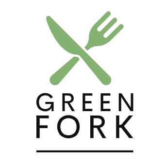

## Overview

This project is the **first of four Milestone Projects** for the **Full Stack Developer** course at The Code Institute. 
Green Fork is a responsive website dedicated to sharing delicious and easy vegan recipes. My mission is to inspire and simplify plant-based cooking for everyone. The site is built using **custom HTML5, CSS3, and minimal JavaScript**, ensuring an accessible, lightweight, and responsive experience across all devices.

Here is a quick preview of how the site looks on various screen sizes:

https://carlssonanton87.github.io/milestone-project-1/

## Table of Contents
- [User Experience (UX)](#user-experience-ux)
  - [Project Goals](#project-goals)
  - [User Stories](#user-stories)
  - [UX Design Rationale](#ux-design-rationale)
- [Design](#design)
  - [Wireframes](#wireframes)
  - [Color Palette & Typography](#color-palette--typography)
  - [Imagery](#imagery)
- [Features](#features)
  - [Existing Features](#existing-features)
  - [Future Features](#future-features)
- [Technologies Used](#technologies-used)
- [Testing](#testing)
- [Deployment](#deployment)
- [How to View Locally](#how-to-view-locally)
- [Credits](#credits)

---

## User Experience (UX)

### Project Goals
The main goals of Green Fork are:
- To provide a visually appealing, structured platform where users can browse plant-based recipes.
- To ensure accessibility across all devices and browsers.
- To introduce beginners to web development using semantic HTML and responsive CSS.
- To create an experience that mimics a real-world recipe website.
- To provide clear navigation, consistent design, and engaging imagery that encourages exploration.

#### User Goals
- Discover a variety of easy and delicious vegan recipes.
- Learn the basics of plant-based cooking.
- Access quick, budget-friendly meal ideas.

#### Site Owner Goals
- Promote vegan cooking and healthy eating.
- Provide comprehensive and inspiring recipe resources.
- Build a community of plant-based cooking enthusiasts.

### User Stories
1. **New Vegan:** As a new vegan, I want simple, step-by-step recipes.  
2. **Busy Professional:** As a busy professional, I want quick meal ideas.  
3. **Budget-Conscious Cook:** As a budget-conscious cook, I want affordable ingredients.  
4. **Curious Food Lover:** As a curious food lover, I want to explore and learn more about vegan cooking.

### UX Design Rationale
My design decisions are rooted in a user-centric approach:

- **User-Focused Layout:**  
  A clean, intuitive structure ensures users quickly locate recipes and understand navigation without distraction.

- **Wireframe-Informed Structure:**  
  Early wireframes guided the placement of essential elements like the header, hero section, content areas, and footer for a smooth user journey across devices.

- **Accessibility & Readability:**  
  Clear typography, sufficient color contrast, and logical content structure enhance accessibility (including ARIA attributes and descriptive alt text).

- **Iterative Design Process:**  
  I continuously refined the layout based on user feedback and testing to improve the user experience.

---

## Design

### Wireframes
I began with low-fidelity wireframes to outline the responsive layout and plan the structure.  
These wireframes were created using the **Mockflow** platform. You can view all wireframes in the [wireframes folder](https://github.com/carlssonanton87/milestone-project-1/tree/main/wireframes).

---

### Color Palette & Typography
**Palette:** [Palette](https://coolors.co/3c4a3e-a4b494-8b9d83-fafaf2-2c2c2c)
| Color             | Hex       | Usage                         |
|------------------|-----------|-------------------------------|
| Sage Green        | `#3C4A3E` | Primary text, nav background  |
| Soft Mint         | `#A4B494` | Highlights & accents          |
| Accent Olive      | `#8B9D83` | Buttons, hover states         |
| Background Cream  | `#FAFAF2` | General background            |
| Text Dark         | `#2C2C2C` | Headings and body text        |

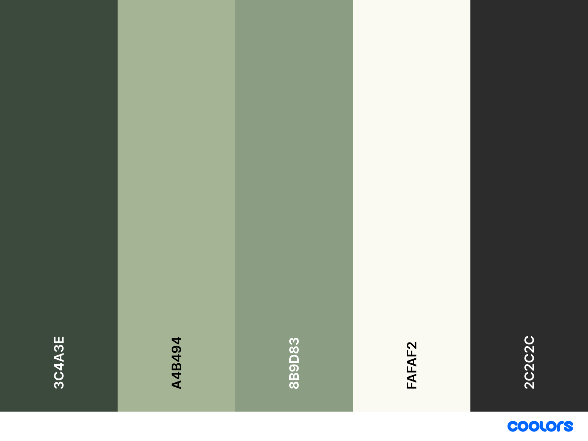

**Fonts**  
- **Headings:** [Playfair Display](https://fonts.google.com/specimen/Playfair+Display) for an elegant, editorial feel.  
- **Body Text:** [Montserrat](https://fonts.google.com/specimen/Montserrat) for simple, modern readability.

### Imagery

All images were sourced from [Unsplash](https://unsplash.com/) and optimized for performance.
---

## Features

### Existing Features

1. **Modern Navigation**  

    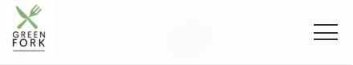

   - A fixed header with a mobile-friendly toggle menu, ensuring easy access to main sections (Home, Recipes, About, Contact).

2. **Hero Section**  

    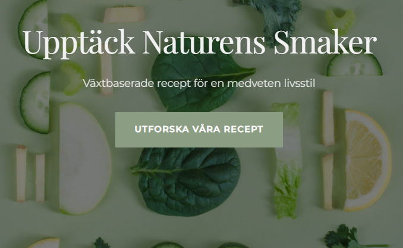

   - An eye-catching hero with a background image and a clear call-to-action (“Utforska Våra Recept”), highlighting the site’s primary goal.

3. **Recipe Section**

    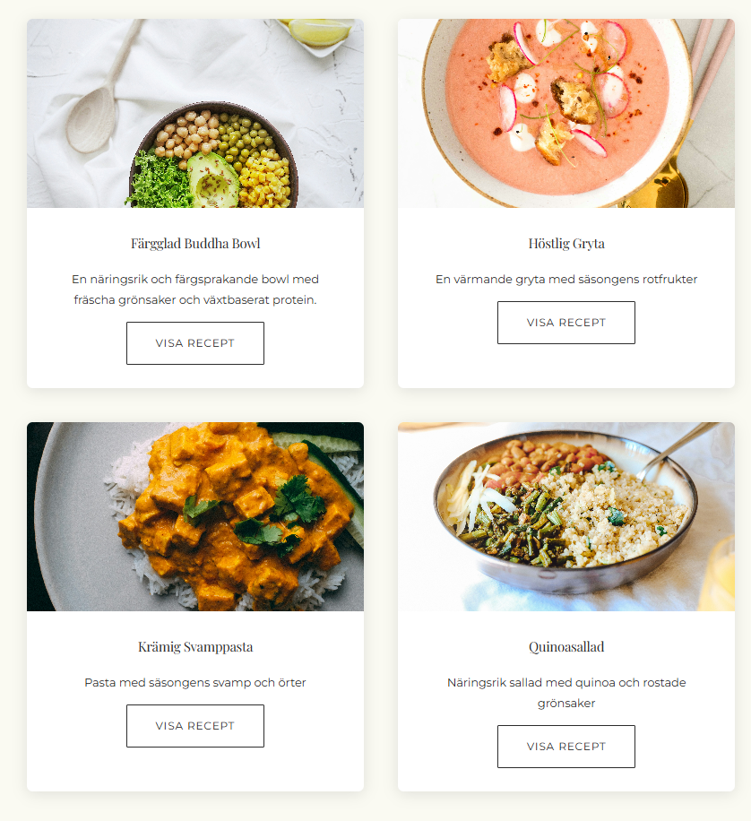

   - A grid of recipe cards (e.g., Buddha Bowl, Höstlig Gryta, Krämig Svamppasta, Quinoasallad), each linking to a dedicated recipe detail page containing ingredients, instructions, and imagery.

4. **Dedicated Recipe Pages** 

    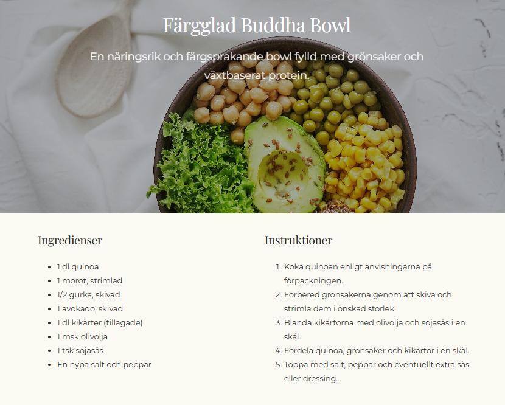 

   - Individual pages (`buddha-bowl.html`, `hostlig-gryta.html`, `kramig-svamppasta.html`, `quinoasallad.html`) provide deeper content for each recipe, including step-by-step instructions, cooking times, and serving suggestions.

5. **About Section**  

    

   - A sleek “About Us” feature on the main page, plus a dedicated `about.html` with more team info and values. The layout includes a mini hero area, a team image, and site values to convey brand identity.

6. **Contact Form**  

    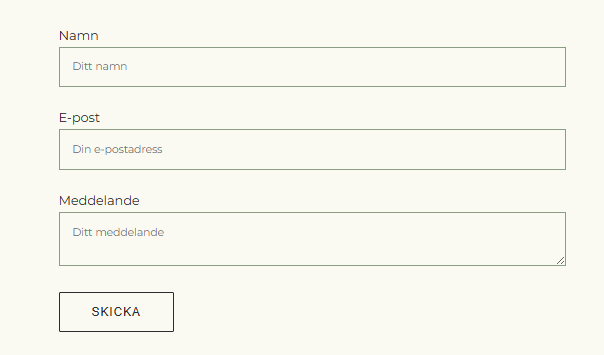

   - A simple, intuitive form allowing users to send inquiries or feedback quickly and conveniently.

7. **Responsive Layout** 

    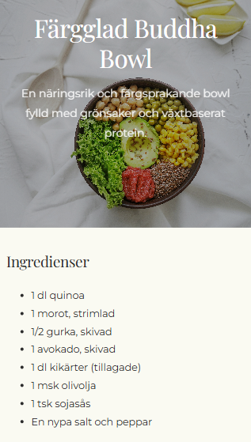

   - Optimized for mobile, tablet, and desktop devices using CSS media queries and mobile-first practices.

### Future Features

- **Recipe Finder**  
  - A “What’s in your kitchen?” tool to suggest recipes based on available ingredients.

- **Nutritional Calculator**  
  - Detailed nutritional breakdown for each recipe.

- **User Submissions**  
  - Let community members share their own vegan recipes.

- **Meal Planning Tools**  
  - Assistance with weekly meal plans and shopping lists.

---

## Technologies Used

### Languages
- **HTML5:** Semantic markup and accessibility features.  
- **CSS3:** Custom styling for layout, animations, and responsiveness.  
- **JavaScript:** Minimal scripting for mobile nav toggle and smooth scrolling.

### Tools
- **Git & GitHub** for version control.
- **Gitpod** as the development environment.    
- **Visual Studio Code** as the development environment.  
- **Live Server Extension** for live preview.  
- **W3C Validators** for HTML/CSS validation.  
- **Chrome DevTools** for responsiveness testing.
- **Mockflow** – Wireframing

---

## Testing

### Validator Testing

#### HTML Validator Results

| Page                      | Screenshot                                                     | Result     |
|---------------------------|----------------------------------------------------------------|------------|
| `index.html`              |         | ✅ Passed  |
| `about.html`              | 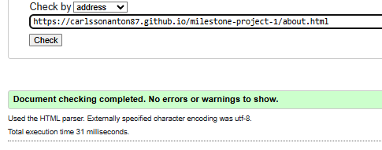        | ✅ Passed  |
| `contact.html`            | 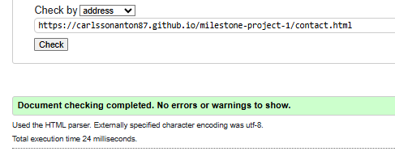    | ✅ Passed  |
| `recipes/buddha-bowl.html`| 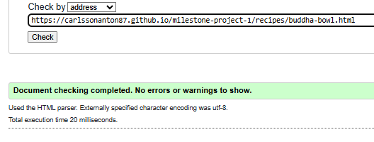      | ✅ Passed  |
| `recipes/hostlig-gryta.html` | 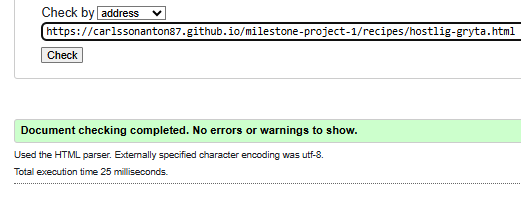   | ✅ Passed  |
| `recipes/kramig-svamppasta.html` |  | ✅ Passed  |
| `recipes/quinoasallad.html` | 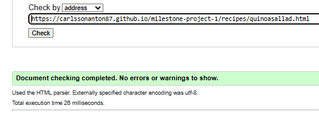 | ✅ Passed  |

#### CSS Validator Results

| Stylesheet            | Screenshot                                                   | Result     |
|------------------------|--------------------------------------------------------------|------------|
| `style.css`            | 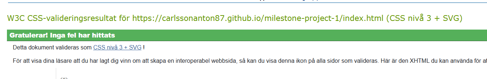    | ✅ Passed  |

### Test Cases

### 🔍 Manual Test Cases

| Test Scenario                         | Steps to Test                                                                                                                                     | Expected Result                                                                                       | Pass/Fail | Screenshot                                                   |
|--------------------------------------|--------------------------------------------------------------------------------------------------------------------------------------------------|--------------------------------------------------------------------------------------------------------|-----------|--------------------------------------------------------------|
| Mobile navigation toggle             | Resize to mobile, click hamburger icon                                                                                                           | Nav menu appears and hides as expected                                                               | ✅ Pass  | 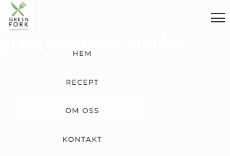          |
| Responsive layout on desktop         | Open site in full-width (1920px) desktop browser                                                                                                 | Layout adjusts properly without overflowing elements                                                  | ✅ Pass  | 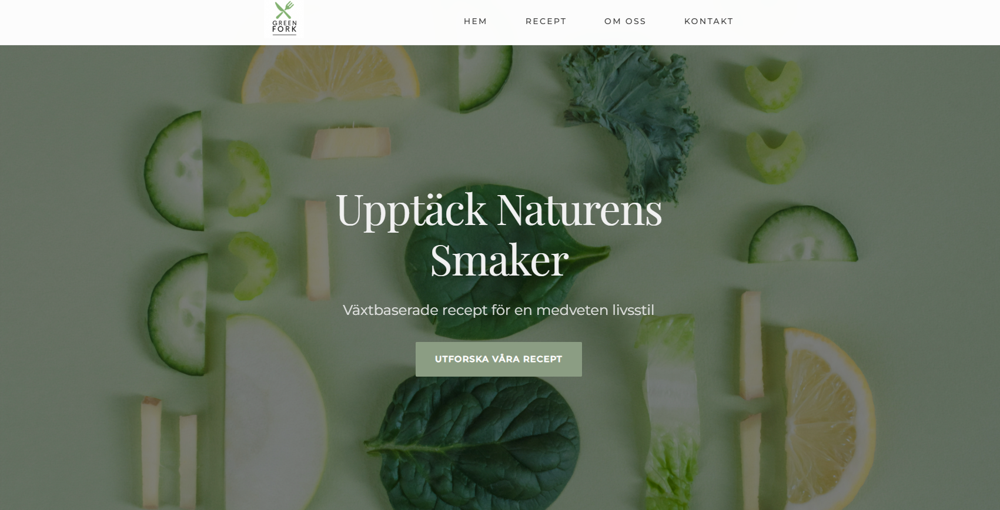      |
| Contact form styling                 | Open `contact.html` and inspect styling of all inputs                                                                                            | All input fields and textareas use consistent font and padding                                       | ✅ Pass  | 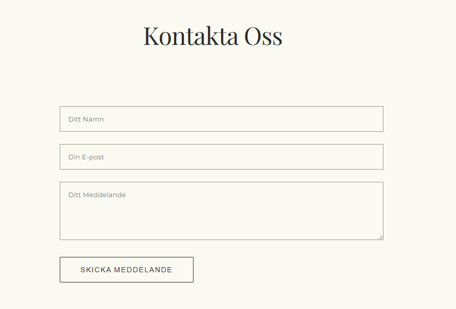      |
| Recipe link from subpages            | From `about.html`, `contact.html`, or recipe pages, click "Recept"                                                                              | Navigates to `index.html#recipes` without 404 error                                                  | ✅ Pass  | 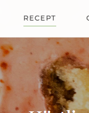|
| Footer social icons                  | Click social media icons in footer                                                                                                               | Opens correct placeholder/social platform in new tab                                                 | ✅ Pass  | 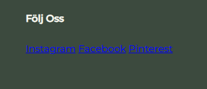      |
| Hero image responsiveness            | View hero section on mobile (iPhone SE, Galaxy S10)                                                                                              | Image scales properly, fills screen without cropping or grey areas                                   | ✅ Pass  | 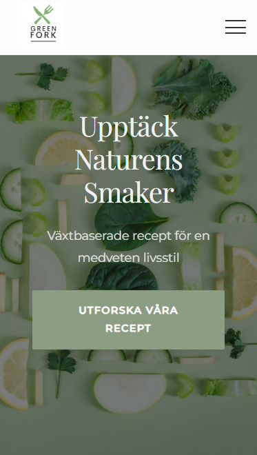        |
| Newsletter submission functionality  | Enter email and click "Prenumerera" button                                                                                                       | Shows alert confirmation, does not redirect or refresh page                                          | ✅ Pass  | 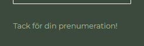          |

---

### Accessibility
- Manual checks for ARIA labels and alt text.  
- Verified color contrast with Chrome DevTools.

### Browser Compatibility
- Tested on Chrome, Firefox, Safari, and Edge.

### Responsiveness
- Verified on multiple real devices (mobile, tablet, desktop).

### Bugs & Fixes

| Issue | Fix |
|-------|-----|
| Mobile nav not opening | Applied `display: flex` instead of `none` in responsive menu styles |
| Recipe link broken from subpages | Changed `href="index.html#recipes"` to `href="../index.html#recipes"` |
| Contact form font mismatch | Unified all `.form-input` styles across input and textarea |
| Hero image cropped on mobile | Adjusted background properties and added padding |
| Newsletter button redirects to homepage | Replaced form action with `event.preventDefault()` and confirmation alert |
| Social links inactive | Updated footer links to point to actual platforms |

---

## Deployment

### GitHub Pages Deployment
1. Log in to your GitHub account.  
2. Navigate to the repository.  
3. Go to **Settings > Pages**.  
4. Select the **main branch** and save.  
5. The site will be live at:  
   [https://carlssonanton87.github.io/milestone-project-1](https://carlssonanton87.github.io/milestone-project-1)  

---

## How to View Locally
bash
1. Clone the repository: `git clone https://github.com/carlssonanton87/milestone-project-1.git`
2. Open the `index.html` file in your browser.

## 🙏 Credits

### 📚 Content

- All recipes were developed, written, and tested by **Anton Carlsson**.
- Inspiration and adaptation ideas were drawn from:
  - [Minimalist Baker](https://minimalistbaker.com/)
  - [Veganuary](https://veganuary.com/)
  - [The Vegan Society](https://www.vegansociety.com/)

### 🖼️ Media

- **Hero and recipe imagery** sourced from [Unsplash](https://unsplash.com) under the Unsplash License.  
  - Hero background: *Photo by Ella Olsson*  
  - Recipe images: *Photos by Brooke Lark, Anna Pelzer

### 🧠 Code Attribution

- **Navigation Menu Toggle:**  
  Code pattern and accessibility ideas adapted from [Kevin Powell's responsive nav tutorial on YouTube](https://www.youtube.com/watch?v=At4B7A4GOPg).
- **ARIA roles and accessibility tags:**  
  Guidance from [MDN Web Docs - ARIA](https://developer.mozilla.org/en-US/docs/Web/Accessibility/ARIA).
- **Smooth scroll behavior:**  
  CSS scroll behavior technique referenced from [CSS Tricks](https://css-tricks.com/snippets/css/smooth-scrolling/).
- **Form Styling Techniques:**  
  Layout and structure inspired by [W3Schools](https://www.w3schools.com/) and peer feedback.
- **HTML & CSS debugging:**  
  Stack Overflow threads and discussions were consulted for resolving layout bugs and responsive image fixes.

### 💬 Acknowledgements

- **Code Institute** for providing the Full Stack Developer curriculum and milestone framework.
- My mentor and Slack community peers for feedback and support throughout the project.
- Fellow learners, tutors, and reviewers for testing and suggestions during development.

### 🧩 Final Thoughts

This project helped me develop confidence in writing structured, semantic HTML and responsive CSS from scratch. It also gave me hands-on experience with accessibility, ARIA roles, form UX, and mobile-first design. I now feel more confident working with multi-page static sites and plan to improve this project further by introducing dynamic recipe filtering and user-generated content features in the future.

